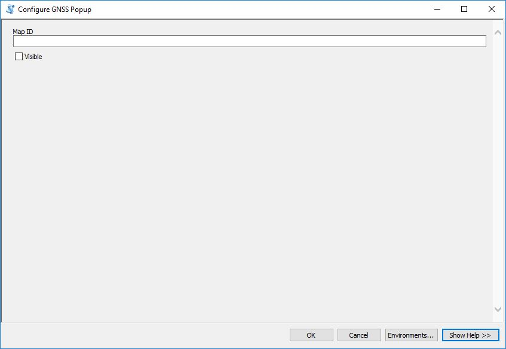

# Configure GNSS Popup 
Changes the visible properties of all ESRIGNSS related attributes in a web map

Supported in at least ArcGIS 10.3.x+ and ArcGIS Pro 1.2+

This tool changes the "visible" property of ESRIGNSS fields in the popup information in the specified web map. It also updates the number of decimals displayed.

### Using as a Script Tool within ArcMap

**You must be signed into a Portal or AGOL Organization**

**Supports 'built-in' and 'SAML' authentication**

1. Connect to the folder containing the "CollectorUtils" toolbox
2. Double click on the "CollectorUtils" toolbox that should be shown in the catalog/project area
3. Double click the "Configure GNSS Popup" script tool (in the "OnlineUtils" toolset)
    1. Visible - Should the GNSS fields be visible or not
    2. ID - The id of the webmap to update (e.g. (f1bad03e6fd74f45a4708d034bd847a4)
5. Click Run



### Using as a standalone script
Two scripts are provided. The [configure_gnss_popup_arcrest.py](configure_gnss_popup_arcrest.py) script relies on the [ArcREST](https://github.com/Esri/ArcREST) library to send requests to Portal and AGOL. This allows organizations that use PKI, IWA/NTLM, and LDAP to authenticate properly. The [configure_gnss_popup.py](configure_gnss_popup.py) script only support the 'built-in' authentication but it is faster.

Run the [configure_gnss_popup.py](configure_gnss_popup.py) script in either Python 2.7+ or Python 3.4+ as:
```python
python configure_gnss_popup.py -u <username> -p <password> -url <org url> <id1> <id2> ... <idn> <visible>
```

It is worth noting that the visible parameters are strings ("true" or "false"). This is so that the script can be using as a script tool in a toolbox as well as called from the commandline properly. In addition the script allows multiple maps to be configured at the same time; just supply all ids at the end.

Example:
```python
python configure_gnss_popup.py -u mycoolusername -p myevencoolerpassword -url "https://myorg.maps.arcgis.com" "t933fe6f51af4a89bac06808da5e7ed3" "true" 
```

----

Run the [configure_gnss_popup_arcrest.py](configure_gnss_popup_arcrest.py) script in either Python 2.7+ or Python 3.4+ as:
```python
python configure_gnss_popup.py -u <username> -p <password> -url <org url> -v -ids <id1> <id2> ...<idn>
```

This shows how to authenticate with 'built-in' security. Additional parameters may be required if other authentication methods are desired (see source code or ArcREST documentation). Adding "-v" sets the the GNSS fields to be visible, not including it will default to false (not visible). In addition the script allows multiple maps to be configured at the same time; just supply all ids after the "-ids" flag.

Example:
```python
python configure_gnss_popup.py -u mycoolusername -p myevencoolerpassword -url "https://myorg.maps.arcgis.com" -v -e -ids "t933fe6f51af4a89bac06808da5e7ed3"
```

### What it does
1. Authenticates with Portal/AGOL and gets a token
2. Gets the specified web map item
3. Gets the data of the web map (json)
4. Updates the "visible" parameter of the popup info json (ESRIGNSS fields only)
5. Submits edits to Portal/AGOL
